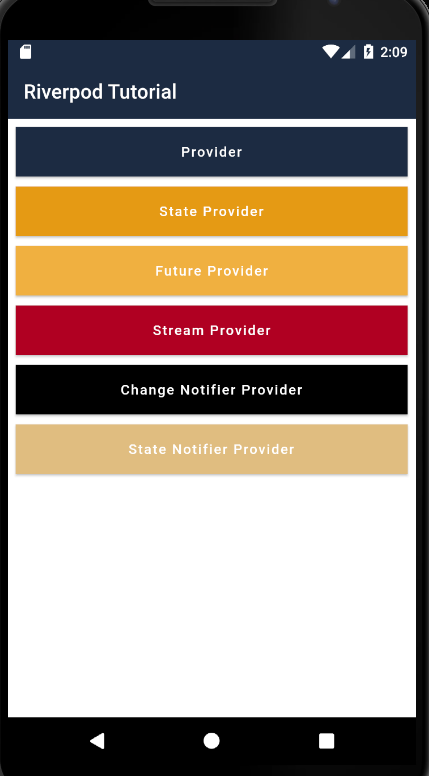

# Flutter Riverpod Tutorial

This Flutter project is a complete tutorial on using Riverpod for state management in Flutter applications. Riverpod is a state management library based on Provider that offers a simple and powerful approach to handling application state.

In this tutorial, we will explore the core concepts of Riverpod and how to use different types of providers available in the library. We will cover the following key topics:

- `Provider`: We will learn how to use the basic `Provider` to provide and consume values in our Flutter application.

- `FutureProvider`: We will discover how to use `FutureProvider` to work with asynchronous operations and load data into our application.

- `StreamProvider`: We will explore how to use `StreamProvider` to handle continuous and reactive data streams.

- `ChangeNotifierProvider`: We will see how to use `ChangeNotifierProvider` to update and notify changes in the application state.

- `StateNotifierProvider`: We will learn how to use `StateNotifierProvider` to manage the mutable state of our application.

## Requirements

- Flutter SDK: 2.0.0 or higher
- Dart: 2.12.0 or higher

## Installation

1. Clone this repository to your local machine:

   ```bash
   git clone https://github.com/brunoBrizo/flutter_riverpod_tutorial.git
   ```

2. Navigate to the project directory:

   ```bash
   cd flutter_riverpod_tutorial
   ```

3. Install the dependencies:

   ```bash
   flutter pub get
   ```

4. Run the application:

   ```bash
   flutter run
   ```

## Contribution

Contributions are welcome! If you find any issues or want to contribute to this project, please feel free to submit a pull request.

## License

This project is licensed under the MIT License. See the [LICENSE](https://github.com/brunoBrizo/flutter_riverpod_tutorial/blob/main/LICENSE) file for more information.

## Acknowledgments

- Thanks to the Flutter and Riverpod teams for providing such amazing frameworks and tools.
- Special thanks to all the contributors and developers who have helped in the creation of this tutorial.

## Screenshots


